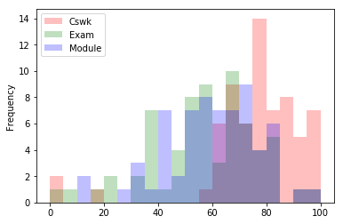
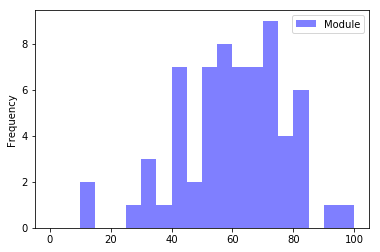
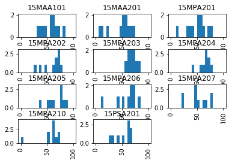
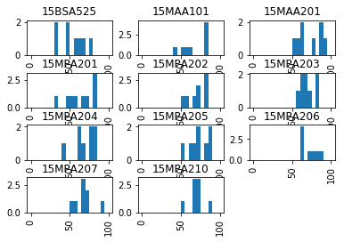
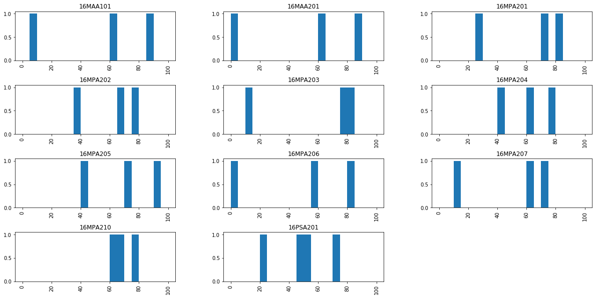

# lboro_results_stats
Python based library to analyse results of Loughborough University modules

Basics of use:
```python
import pandas
import numpy as np
import matplotlib
import matplotlib.pyplot as plt

%matplotlib inline
# set default plot size
plt.rcParams['figure.figsize'] = (20.0, 10.0)
import MPStats_3_0 as t
```

# Test data
Get data extract from LUSI.

Student Marks Extracts - Module Marks  > 

Regno (like) '%',
Prog code 'MP%',
Module like '15%',
Module instance like '%',
Part like '%A%'

This captures all the results for Materials' Part A students in AY 15-16


## ProgPartStats
Generates table of statistics for given Part/Programme
ProgPartStats(filename='Module Marks-3a.xls',programme_list=[''],part='A',module_list=[],bins=20,elements=False,dp=2,latex=true)


```python
t.ProgPartStats(filename='Module Marks-3a.xls',latex=True,programme_list=['MPUB01','MPUM01','MPUB02','MPUM02','MPUB05','MPUM05','MPUB18','MPUM18'],part='A',module_list=[],bins=20,elements=False,dp=2)
```

    \begin{tabular}{lllllllllll}
    \toprule
       Module & All cohorts & StDev & MPUB01 & MPUM01 & MPUB02 & MPUM02 & MPUB05 & MPUM05 & MPUB18 & MPUM18 \\
    \midrule
     16MPA201 &        64.7 &  15.9 &   65.8 &   76.1 &   56.3 &     -- &   61.7 &     69 &   45.7 &     60 \\
     16MPA202 &       63.95 &  16.8 &   62.4 &   72.8 &   62.2 &     -- &   60.3 &   66.8 &   72.5 &   46.7 \\
     16MPA203 &       69.22 &  15.2 &     68 &     75 &   67.9 &     -- &   57.3 &   62.2 &     83 &   85.5 \\
     16MPA204 &       66.44 &  11.9 &   65.4 &   69.1 &   64.9 &     -- &     61 &   66.7 &   72.5 &     72 \\
     16MPA205 &       71.42 &  16.9 &   72.3 &     84 &   61.8 &     -- &     68 &   70.2 &   56.3 &   75.5 \\
     16MPA206 &       57.78 &  18.2 &   60.2 &     61 &   47.1 &     -- &   69.5 &   60.2 &     54 &     46 \\
     16MPA207 &       56.96 &  20.2 &   60.4 &   66.4 &   55.5 &     -- &     48 &   48.5 &   38.3 &     53 \\
     16MPA210 &       67.45 &   5.6 &     67 &   67.1 &   67.8 &     -- &   68.3 &   64.5 &   66.5 &     81 \\
    \bottomrule
    \end{tabular}
    


### StatFrame  
This function is largely superceded by ProgPartStats (above)
* generates a dataframe of the statistics for all modules in file
* can limit to specific modules via module_list
* get additional colums by programme if list is added. 
* There is a file size limit (~1.2MB).

The option latex=True results in pretty latex code to be dropped into a .tex file


```python

programme_l=['MPUB01','MPUM01','MPUB02','MPUM02','MPUB05','MPUM05','MPUB18','MPUM18']
t.StatFrame(filename='Module Marks-2.xls',programme_list=programme_l)
```
<div>
<table border="1" class="dataframe">
  <thead>
    <tr style="text-align: right;">
      <th></th>
      <th>Module</th>
      <th>All cohorts</th>
      <th>StDev</th>
      <th>MPUB01</th>
      <th>MPUM01</th>
      <th>MPUB02</th>
      <th>MPUM02</th>
      <th>MPUB05</th>
      <th>MPUM05</th>
      <th>MPUB18</th>
      <th>MPUM18</th>
    </tr>
  </thead>
  <tbody>
    <tr>
      <th>0</th>
      <td>15BSA525</td>
      <td>49.8</td>
      <td>14.8</td>
      <td>49.2</td>
      <td>52.2</td>
      <td>NaN</td>
      <td>NaN</td>
      <td>NaN</td>
      <td>NaN</td>
      <td>NaN</td>
      <td>NaN</td>
    </tr>
    <tr>
      <th>1</th>
      <td>15BSB560</td>
      <td>55.2</td>
      <td>9.3</td>
      <td>55.5</td>
      <td>56.2</td>
      <td>NaN</td>
      <td>NaN</td>
      <td>NaN</td>
      <td>NaN</td>
      <td>50.5</td>
      <td>59</td>
    </tr>
    <tr>
      <th>2</th>
      <td>15BSB580</td>
      <td>55.6</td>
      <td>13.3</td>
      <td>67.5</td>
      <td>67</td>
      <td>NaN</td>
      <td>NaN</td>
      <td>NaN</td>
      <td>NaN</td>
      <td>NaN</td>
      <td>NaN</td>
    </tr>
    <tr>
      <th>3</th>
      <td>15BSC144</td>
      <td>56.8</td>
      <td>13.5</td>
      <td>57</td>
      <td>60.9</td>
      <td>NaN</td>
      <td>NaN</td>
      <td>NaN</td>
      <td>NaN</td>
      <td>38</td>
      <td>65</td>
    </tr>
    <tr>
      <th>4</th>
      <td>15BSC522</td>
      <td>63</td>
      <td>NaN</td>
      <td>NaN</td>
      <td>NaN</td>
      <td>NaN</td>
      <td>NaN</td>
      <td>NaN</td>
      <td>NaN</td>
      <td>NaN</td>
      <td>63</td>
    </tr>
    <tr>
      <th>5</th>
      <td>15BSPE01</td>
      <td>69.1</td>
      <td>2.7</td>
      <td>NaN</td>
      <td>NaN</td>
      <td>NaN</td>
      <td>NaN</td>
      <td>NaN</td>
      <td>NaN</td>
      <td>NaN</td>
      <td>NaN</td>
    </tr>
    <tr>
      <th>6</th>
      <td>15CGB018</td>
      <td>52.8</td>
      <td>17.1</td>
      <td>50.9</td>
      <td>68.8</td>
      <td>51.5</td>
      <td>59</td>
      <td>NaN</td>
      <td>NaN</td>
      <td>49.6</td>
      <td>NaN</td>
    </tr>
    <tr>
      <th>7</th>
      <td>15CMF001</td>
      <td>62.8</td>
      <td>6.7</td>
      <td>59.5</td>
      <td>NaN</td>
      <td>62</td>
      <td>NaN</td>
      <td>NaN</td>
      <td>70</td>
      <td>NaN</td>
      <td>NaN</td>
    </tr>
    <tr>
      <th>8</th>
      <td>15CMF006</td>
      <td>66</td>
      <td>3.6</td>
      <td>66</td>
      <td>NaN</td>
      <td>66</td>
      <td>NaN</td>
      <td>NaN</td>
      <td>NaN</td>
      <td>NaN</td>
      <td>NaN</td>
    </tr>
    <tr>
      <th>9</th>
      <td>15CMF010</td>
      <td>54</td>
      <td>NaN</td>
      <td>54</td>
      <td>NaN</td>
      <td>NaN</td>
      <td>NaN</td>
      <td>NaN</td>
      <td>NaN</td>
      <td>NaN</td>
      <td>NaN</td>
    </tr>
    <tr>
      <th>10</th>
      <td>15COF180</td>
      <td>64</td>
      <td>NaN</td>
      <td>NaN</td>
      <td>NaN</td>
      <td>64</td>
      <td>NaN</td>
      <td>NaN</td>
      <td>NaN</td>
      <td>NaN</td>
      <td>NaN</td>
    </tr>
    <tr>
      <th>11</th>
      <td>15COF181</td>
      <td>40</td>
      <td>NaN</td>
      <td>NaN</td>
      <td>NaN</td>
      <td>40</td>
      <td>NaN</td>
      <td>NaN</td>
      <td>NaN</td>
      <td>NaN</td>
      <td>NaN</td>
    </tr>
    <tr>
      <th>12</th>
      <td>15CVC002</td>
      <td>62</td>
      <td>NaN</td>
      <td>NaN</td>
      <td>NaN</td>
      <td>NaN</td>
      <td>NaN</td>
      <td>NaN</td>
      <td>NaN</td>
      <td>NaN</td>
      <td>NaN</td>
    </tr>
    <tr>
      <th>13</th>
      <td>15LAN121</td>
      <td>63</td>
      <td>5.7</td>
      <td>67</td>
      <td>59</td>
      <td>NaN</td>
      <td>NaN</td>
      <td>NaN</td>
      <td>NaN</td>
      <td>NaN</td>
      <td>NaN</td>
    </tr>
    <tr>
      <th>14</th>
      <td>15LAN123</td>
      <td>63</td>
      <td>NaN</td>
      <td>NaN</td>
      <td>63</td>
      <td>NaN</td>
      <td>NaN</td>
      <td>NaN</td>
      <td>NaN</td>
      <td>NaN</td>
      <td>NaN</td>
    </tr>
    <tr>
      <th>15</th>
      <td>15LAN221</td>
      <td>75</td>
      <td>NaN</td>
      <td>75</td>
      <td>NaN</td>
      <td>NaN</td>
      <td>NaN</td>
      <td>NaN</td>
      <td>NaN</td>
      <td>NaN</td>
      <td>NaN</td>
    </tr>
    <tr>
      <th>16</th>
      <td>15LAN303</td>
      <td>76</td>
      <td>NaN</td>
      <td>NaN</td>
      <td>NaN</td>
      <td>NaN</td>
      <td>NaN</td>
      <td>NaN</td>
      <td>NaN</td>
      <td>NaN</td>
      <td>NaN</td>
    </tr>
    <tr>
      <th>17</th>
      <td>15LAN321</td>
      <td>65.6</td>
      <td>7.5</td>
      <td>67.5</td>
      <td>58</td>
      <td>NaN</td>
      <td>NaN</td>
      <td>NaN</td>
      <td>NaN</td>
      <td>NaN</td>
      <td>NaN</td>
    </tr>
    <tr>
      <th>18</th>
      <td>15LAN322</td>
      <td>70</td>
      <td>NaN</td>
      <td>NaN</td>
      <td>70</td>
      <td>NaN</td>
      <td>NaN</td>
      <td>NaN</td>
      <td>NaN</td>
      <td>NaN</td>
      <td>NaN</td>
    </tr>
    <tr>
      <th>19</th>
      <td>15LAN401</td>
      <td>83</td>
      <td>2.8</td>
      <td>81</td>
      <td>85</td>
      <td>NaN</td>
      <td>NaN</td>
      <td>NaN</td>
      <td>NaN</td>
      <td>NaN</td>
      <td>NaN</td>
    </tr>
    <tr>
      <th>20</th>
      <td>15MAA101</td>
      <td>60.6</td>
      <td>19</td>
      <td>60.6</td>
      <td>68.2</td>
      <td>61.8</td>
      <td>NaN</td>
      <td>55.8</td>
      <td>59</td>
      <td>52.4</td>
      <td>82</td>
    </tr>
    <tr>
      <th>21</th>
      <td>15MAA201</td>
      <td>60.7</td>
      <td>25.7</td>
      <td>61.5</td>
      <td>72.1</td>
      <td>63.1</td>
      <td>NaN</td>
      <td>45.8</td>
      <td>82</td>
      <td>54.6</td>
      <td>86.5</td>
    </tr>
    <tr>
      <th>22</th>
      <td>15MAB101</td>
      <td>50.7</td>
      <td>16.7</td>
      <td>48.2</td>
      <td>63</td>
      <td>47</td>
      <td>65</td>
      <td>NaN</td>
      <td>NaN</td>
      <td>NaN</td>
      <td>48.5</td>
    </tr>
    <tr>
      <th>23</th>
      <td>15MAB206</td>
      <td>57.4</td>
      <td>20.7</td>
      <td>51.1</td>
      <td>73.8</td>
      <td>70.8</td>
      <td>77</td>
      <td>NaN</td>
      <td>NaN</td>
      <td>NaN</td>
      <td>52.3</td>
    </tr>
    <tr>
      <th>24</th>
      <td>15MAF001</td>
      <td>70.5</td>
      <td>7.7</td>
      <td>76.3</td>
      <td>NaN</td>
      <td>66</td>
      <td>NaN</td>
      <td>NaN</td>
      <td>62</td>
      <td>NaN</td>
      <td>NaN</td>
    </tr>
    <tr>
      <th>25</th>
      <td>15MAF002</td>
      <td>73.8</td>
      <td>6.3</td>
      <td>72</td>
      <td>NaN</td>
      <td>77.5</td>
      <td>NaN</td>
      <td>NaN</td>
      <td>72</td>
      <td>NaN</td>
      <td>NaN</td>
    </tr>
    <tr>
      <th>26</th>
      <td>15MMC204</td>
      <td>55</td>
      <td>1.4</td>
      <td>NaN</td>
      <td>55</td>
      <td>NaN</td>
      <td>NaN</td>
      <td>NaN</td>
      <td>NaN</td>
      <td>NaN</td>
      <td>NaN</td>
    </tr>
    <tr>
      <th>27</th>
      <td>15MMC206</td>
      <td>65.3</td>
      <td>6.2</td>
      <td>NaN</td>
      <td>65.3</td>
      <td>NaN</td>
      <td>NaN</td>
      <td>NaN</td>
      <td>NaN</td>
      <td>NaN</td>
      <td>NaN</td>
    </tr>
    <tr>
      <th>28</th>
      <td>15MMC910</td>
      <td>50.9</td>
      <td>21.9</td>
      <td>41.4</td>
      <td>74.5</td>
      <td>NaN</td>
      <td>NaN</td>
      <td>NaN</td>
      <td>NaN</td>
      <td>NaN</td>
      <td>NaN</td>
    </tr>
    <tr>
      <th>29</th>
      <td>15MMF110</td>
      <td>57.4</td>
      <td>11.9</td>
      <td>55.7</td>
      <td>NaN</td>
      <td>51</td>
      <td>NaN</td>
      <td>NaN</td>
      <td>69</td>
      <td>NaN</td>
      <td>NaN</td>
    </tr>
    <tr>
      <th>...</th>
      <td>...</td>
      <td>...</td>
      <td>...</td>
      <td>...</td>
      <td>...</td>
      <td>...</td>
      <td>...</td>
      <td>...</td>
      <td>...</td>
      <td>...</td>
      <td>...</td>
    </tr>
    <tr>
      <th>93</th>
      <td>15MPP509</td>
      <td>71.2</td>
      <td>8.2</td>
      <td>NaN</td>
      <td>NaN</td>
      <td>NaN</td>
      <td>NaN</td>
      <td>NaN</td>
      <td>NaN</td>
      <td>NaN</td>
      <td>NaN</td>
    </tr>
    <tr>
      <th>94</th>
      <td>15MPP551</td>
      <td>60.6</td>
      <td>9.3</td>
      <td>NaN</td>
      <td>63</td>
      <td>NaN</td>
      <td>72</td>
      <td>NaN</td>
      <td>NaN</td>
      <td>NaN</td>
      <td>61</td>
    </tr>
    <tr>
      <th>95</th>
      <td>15MPP552</td>
      <td>73.1</td>
      <td>5.2</td>
      <td>NaN</td>
      <td>NaN</td>
      <td>NaN</td>
      <td>NaN</td>
      <td>NaN</td>
      <td>NaN</td>
      <td>NaN</td>
      <td>NaN</td>
    </tr>
    <tr>
      <th>96</th>
      <td>15MPP553</td>
      <td>54</td>
      <td>8.6</td>
      <td>NaN</td>
      <td>NaN</td>
      <td>NaN</td>
      <td>NaN</td>
      <td>NaN</td>
      <td>NaN</td>
      <td>NaN</td>
      <td>NaN</td>
    </tr>
    <tr>
      <th>97</th>
      <td>15MPP554</td>
      <td>54.1</td>
      <td>9.8</td>
      <td>NaN</td>
      <td>NaN</td>
      <td>NaN</td>
      <td>NaN</td>
      <td>NaN</td>
      <td>NaN</td>
      <td>NaN</td>
      <td>NaN</td>
    </tr>
    <tr>
      <th>98</th>
      <td>15MPP555</td>
      <td>67.4</td>
      <td>9.6</td>
      <td>NaN</td>
      <td>NaN</td>
      <td>NaN</td>
      <td>NaN</td>
      <td>NaN</td>
      <td>NaN</td>
      <td>NaN</td>
      <td>NaN</td>
    </tr>
    <tr>
      <th>99</th>
      <td>15MPP556</td>
      <td>68.6</td>
      <td>5.3</td>
      <td>NaN</td>
      <td>71.2</td>
      <td>NaN</td>
      <td>76</td>
      <td>NaN</td>
      <td>NaN</td>
      <td>NaN</td>
      <td>71</td>
    </tr>
    <tr>
      <th>100</th>
      <td>15MPP558</td>
      <td>65.8</td>
      <td>6.1</td>
      <td>NaN</td>
      <td>NaN</td>
      <td>NaN</td>
      <td>NaN</td>
      <td>NaN</td>
      <td>NaN</td>
      <td>NaN</td>
      <td>NaN</td>
    </tr>
    <tr>
      <th>101</th>
      <td>15MPP559</td>
      <td>64.1</td>
      <td>7.6</td>
      <td>NaN</td>
      <td>NaN</td>
      <td>NaN</td>
      <td>NaN</td>
      <td>NaN</td>
      <td>NaN</td>
      <td>NaN</td>
      <td>NaN</td>
    </tr>
    <tr>
      <th>102</th>
      <td>15MPP563</td>
      <td>55.5</td>
      <td>10.8</td>
      <td>NaN</td>
      <td>NaN</td>
      <td>NaN</td>
      <td>NaN</td>
      <td>NaN</td>
      <td>NaN</td>
      <td>NaN</td>
      <td>NaN</td>
    </tr>
    <tr>
      <th>103</th>
      <td>15MPP601</td>
      <td>47.8</td>
      <td>12.3</td>
      <td>NaN</td>
      <td>NaN</td>
      <td>NaN</td>
      <td>NaN</td>
      <td>NaN</td>
      <td>NaN</td>
      <td>NaN</td>
      <td>NaN</td>
    </tr>
    <tr>
      <th>104</th>
      <td>15MPP602</td>
      <td>55.2</td>
      <td>21.2</td>
      <td>NaN</td>
      <td>NaN</td>
      <td>NaN</td>
      <td>NaN</td>
      <td>NaN</td>
      <td>NaN</td>
      <td>NaN</td>
      <td>NaN</td>
    </tr>
    <tr>
      <th>105</th>
      <td>15MPP603</td>
      <td>69.8</td>
      <td>15.6</td>
      <td>NaN</td>
      <td>NaN</td>
      <td>NaN</td>
      <td>NaN</td>
      <td>NaN</td>
      <td>NaN</td>
      <td>NaN</td>
      <td>NaN</td>
    </tr>
    <tr>
      <th>106</th>
      <td>15MPP606</td>
      <td>64.4</td>
      <td>17.8</td>
      <td>NaN</td>
      <td>NaN</td>
      <td>NaN</td>
      <td>NaN</td>
      <td>NaN</td>
      <td>NaN</td>
      <td>NaN</td>
      <td>NaN</td>
    </tr>
    <tr>
      <th>107</th>
      <td>15MPP652</td>
      <td>70</td>
      <td>8.7</td>
      <td>NaN</td>
      <td>NaN</td>
      <td>NaN</td>
      <td>NaN</td>
      <td>NaN</td>
      <td>NaN</td>
      <td>NaN</td>
      <td>NaN</td>
    </tr>
    <tr>
      <th>108</th>
      <td>15MPP653</td>
      <td>62.3</td>
      <td>5</td>
      <td>NaN</td>
      <td>NaN</td>
      <td>NaN</td>
      <td>NaN</td>
      <td>NaN</td>
      <td>NaN</td>
      <td>NaN</td>
      <td>NaN</td>
    </tr>
    <tr>
      <th>109</th>
      <td>15MPP654</td>
      <td>66.2</td>
      <td>5.7</td>
      <td>NaN</td>
      <td>NaN</td>
      <td>NaN</td>
      <td>NaN</td>
      <td>NaN</td>
      <td>NaN</td>
      <td>NaN</td>
      <td>NaN</td>
    </tr>
    <tr>
      <th>110</th>
      <td>15MPP655</td>
      <td>50.3</td>
      <td>17.1</td>
      <td>NaN</td>
      <td>NaN</td>
      <td>NaN</td>
      <td>NaN</td>
      <td>NaN</td>
      <td>NaN</td>
      <td>NaN</td>
      <td>NaN</td>
    </tr>
    <tr>
      <th>111</th>
      <td>15MPP801</td>
      <td>69</td>
      <td>9.2</td>
      <td>NaN</td>
      <td>NaN</td>
      <td>NaN</td>
      <td>NaN</td>
      <td>NaN</td>
      <td>NaN</td>
      <td>NaN</td>
      <td>NaN</td>
    </tr>
    <tr>
      <th>112</th>
      <td>15MPP803</td>
      <td>71.5</td>
      <td>2.1</td>
      <td>NaN</td>
      <td>NaN</td>
      <td>NaN</td>
      <td>NaN</td>
      <td>NaN</td>
      <td>NaN</td>
      <td>NaN</td>
      <td>NaN</td>
    </tr>
    <tr>
      <th>113</th>
      <td>15PHF110</td>
      <td>66.8</td>
      <td>7.5</td>
      <td>69</td>
      <td>NaN</td>
      <td>65</td>
      <td>NaN</td>
      <td>NaN</td>
      <td>64</td>
      <td>NaN</td>
      <td>NaN</td>
    </tr>
    <tr>
      <th>114</th>
      <td>15PHF210</td>
      <td>61.5</td>
      <td>4.4</td>
      <td>63.5</td>
      <td>NaN</td>
      <td>57.5</td>
      <td>NaN</td>
      <td>NaN</td>
      <td>NaN</td>
      <td>NaN</td>
      <td>NaN</td>
    </tr>
    <tr>
      <th>115</th>
      <td>15PSA201</td>
      <td>53.9</td>
      <td>15.8</td>
      <td>NaN</td>
      <td>NaN</td>
      <td>NaN</td>
      <td>NaN</td>
      <td>52.4</td>
      <td>67</td>
      <td>NaN</td>
      <td>NaN</td>
    </tr>
    <tr>
      <th>116</th>
      <td>15TTA107</td>
      <td>65.6</td>
      <td>16</td>
      <td>NaN</td>
      <td>NaN</td>
      <td>65.6</td>
      <td>NaN</td>
      <td>NaN</td>
      <td>NaN</td>
      <td>NaN</td>
      <td>NaN</td>
    </tr>
    <tr>
      <th>117</th>
      <td>15TTB107</td>
      <td>64</td>
      <td>10</td>
      <td>NaN</td>
      <td>NaN</td>
      <td>60</td>
      <td>80</td>
      <td>NaN</td>
      <td>NaN</td>
      <td>NaN</td>
      <td>NaN</td>
    </tr>
    <tr>
      <th>118</th>
      <td>15TTB110</td>
      <td>58.2</td>
      <td>18.6</td>
      <td>NaN</td>
      <td>NaN</td>
      <td>56.4</td>
      <td>67</td>
      <td>NaN</td>
      <td>NaN</td>
      <td>NaN</td>
      <td>NaN</td>
    </tr>
    <tr>
      <th>119</th>
      <td>15TTB210</td>
      <td>54.6</td>
      <td>7.5</td>
      <td>NaN</td>
      <td>NaN</td>
      <td>54.4</td>
      <td>57</td>
      <td>NaN</td>
      <td>NaN</td>
      <td>NaN</td>
      <td>NaN</td>
    </tr>
    <tr>
      <th>120</th>
      <td>15TTC064</td>
      <td>50</td>
      <td>NaN</td>
      <td>NaN</td>
      <td>NaN</td>
      <td>NaN</td>
      <td>50</td>
      <td>NaN</td>
      <td>NaN</td>
      <td>NaN</td>
      <td>NaN</td>
    </tr>
    <tr>
      <th>121</th>
      <td>15TTD106</td>
      <td>63.5</td>
      <td>13.4</td>
      <td>NaN</td>
      <td>NaN</td>
      <td>NaN</td>
      <td>NaN</td>
      <td>NaN</td>
      <td>NaN</td>
      <td>NaN</td>
      <td>NaN</td>
    </tr>
    <tr>
      <th>122</th>
      <td>15TTP451</td>
      <td>73.5</td>
      <td>2.1</td>
      <td>NaN</td>
      <td>NaN</td>
      <td>NaN</td>
      <td>NaN</td>
      <td>NaN</td>
      <td>NaN</td>
      <td>NaN</td>
      <td>NaN</td>
    </tr>
  </tbody>
</table>
<p>123 rows × 11 columns</p>
</div>


```python
t.StatFrame(filename='Module Marks-3.xls',module_list=['15MPA205','15MPA211'])

```


<div>
<table border="1" class="dataframe">
  <thead>
    <tr style="text-align: right;">
      <th></th>
      <th>Module</th>
      <th>All cohorts</th>
      <th>StDev</th>
    </tr>
  </thead>
  <tbody>
    <tr>
      <th>0</th>
      <td>15MPA205</td>
      <td>69.5968</td>
      <td>14.7075</td>
    </tr>
    <tr>
      <th>1</th>
      <td>15MPA211</td>
      <td>62.1429</td>
      <td>9.35287</td>
    </tr>
  </tbody>
</table>
</div>


## HistoModule

Generates a histogram for the results for a given module.
HistoModule(filename='Module Marks.xls',module_name='',bins=20,elements=False,debug=False):
    """creates a pandas histogram of the results for specified module
        Inputs: 
            filename is an excel file from LUSI system includes Module marks and programmes
        module_code is the code for the module of interest e.g. '15MPA201'
        bins=number of bins for the data
        elements=True causes the results for both exam and CW to be displayed 
        """


```python
t.HistoModule(module_name='15MPA201',filename='Module Marks-3.xls',bins=20,elements=True)
```





```python
t.HistoModule(module_name='15MPA201',filename='Module Marks-3.xls',bins=20)
```





# ProgPartHist
Generates arrays of histograms by programme/part. Can limit to specific module list

ProgPartHist(filename='Module Marks.xls',programme_list=[],part_list=[],module_list=[],bins=20,elements=False,debug=False):
    """ creates array of histograms of modules for given programmes/parts/modules
        if the lists are blank then it will go through everything"""
        


```python
t.ProgPartHist(filename='Module Marks-3.xls',bins=20,debug=False,programme_list=['MPUB05','MPUM01'],module_list=[])
```

    prog= MPUB05
    prog= MPUM01








```python
t.ProgPartHist(filename='Module Marks-4.xls',bins=20,debug=False,programme_list=[],module_list=[],part_list=['A'])
```

    prog= MPUB05





# Notes
to reload a module: 
1. import importlib
2. importlib.reload(module_name)


